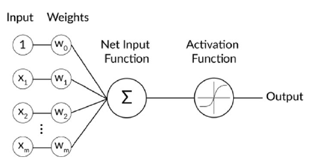

In Keras, all the nodes of a layer can be initialized by simply initializing the layer itself. The individual
operation of a generalized layer node can be seen in the following diagram. At each
node, the input data is multiplied by a set of weights using matrix multiplication. The sum of the product between the weights and the
input is applied, which may or may not include a bias, as shown by the input node equal
to 1 in the following diagram. Further functions may be applied to the output of this
matrix multiplication, such as activation functions:

## Note on Keras Sequential model

There are two ways to build Keras models: sequential and functional.

**The sequential API** allows you to create models layer-by-layer for most problems. It is limited in that it does not allow you to create models that share layers or have multiple inputs or outputs.
In short, you create a sequential model where you can easily add layers, and each layer can have convolution, max pooling, activation, drop-­out, and batch normalization.

Alternatively, **the functional API** allows you to create models that have a lot more flexibility as you can easily define models where layers connect to more than just the previous and next layers. In fact, you can connect layers to (literally) any other layer. As a result, creating complex networks such as siamese networks and residual networks become possible.

From the definition of Keras documentation the Sequential model is a linear stack of layers. You can create a Sequential model by passing a list of layer instances to the constructor. The common architecture of ConvNets is a sequential architecture. However, some architectures are not linear stacks. For example, siamese networks are two parallel neural networks with some shared layers.

With the Sequential Models, you need to ensure the
input layer has the right number of inputs. Assume that you have 3,072
input variables; then you need to create the first hidden layer with 512
nodes/neurons. In the second hidden layer, you have 120 nodes/neurons.
Finally, you have ten nodes in the output layer. For example, an image
maps onto ten nodes that shows the probability of being label1 (airplane),
label2 (automobile), label3 (cat), ..., label10 (truck). The node of highest
probability is the predicted class/label.

### Some common layer types in Keras are as follows:

**Dense**: This is a fully connected layer in which all the nodes of the layer are
directly connected to all the inputs and all the outputs. ANNs for classification or
regression tasks on tabular data usually have a large percentage of their layers with
this type in the architecture.

**Convolutional**: This layer type creates a convolutional kernel that is convolved with
the input layer to produce a tensor of outputs. This convolution can occur in one
or multiple dimensions. ANNs for the classification of images usually feature one or
more convolutional layers in their architecture.

**Pooling**: This type of layer is used to reduce the dimensionality of an input layer.
Common types of pooling include max pooling, in which the maximum value of
a given window is passed through to the output, or average pooling, in which
the average value of a window is passed through. These layers are often used
in conjunction with a convolutional layer, and their purpose is to reduce the
dimensions of the subsequent layers, allowing for fewer training parameters to be
learned with little information loss.

**Recurrent**: Recurrent layers learn patterns from sequences, so each output is
dependent on the results from the previous step. ANNs that model sequential data
such as natural language or time-series data often feature one or more recurrent
layer types.

There are other layer types in Keras; however, these are the most common types when
it comes to building models using Keras.

---

## Why I would need a Data Generator Function for Keras Sequential Model building

The key reason is to be able to handle large data with batching, so the RAM/CPU/GPU does not need to handle the full data at once, which will anyway not be possible for this 72GB dataset.

**DatGgenerator(Sequence)** => Now, let's go through the details of how to set the Python class DataGenerator, which will be used for real-time data feeding to your Keras model. We make this inherit the properties of `keras.utils.Sequence` so that we can leverage nice functionalities such as multiprocessing.